# OAuth 2.0 & OpenID Connect Server Implementation in Go

A comprehensive, production-ready OAuth 2.0 authorization server and OpenID Connect provider built from scratch in Go, implementing multiple RFC standards and security best practices.

## 🎯 Overview

This implementation provides a complete OAuth 2.0 authorization server with OpenID Connect capabilities, supporting all major grant types, advanced security features, and enterprise-grade functionality.

## 📋 Table of Contents

- [Features](#-features)
- [OAuth 2.0 & OpenID Connect Explained](#-oauth-20--openid-connect-explained)
- [Architecture](#-architecture)
- [Supported Grant Types](#-supported-grant-types)
- [Installation & Setup](#-installation--setup)
- [OAuth 2.0 Flow Examples](#-oauth-20-flow-examples)
- [API Documentation](#-api-documentation)
- [Security Features](#-security-features)
- [Configuration](#-configuration)
- [Testing](#-testing)
- [Production Deployment](#-production-deployment)
- [Standards Compliance](#-standards-compliance)

## 🚀 Features

### OAuth 2.0 Grant Types
- ✅ **Authorization Code Grant** with PKCE (RFC 7636)
- ✅ **Client Credentials Grant**
- ✅ **Refresh Token Grant** with rotation
- ✅ **Resource Owner Password Credentials Grant**
- ✅ **Implicit Grant** (deprecated but supported)
- ✅ **Device Authorization Grant** (RFC 8628)
- ✅ **JWT Bearer Grant** (RFC 7523)
- ✅ **Token Exchange Grant** (RFC 8693)

### OpenID Connect Features
- ✅ **ID Token Generation** with standard claims
- ✅ **UserInfo Endpoint** with scope-based claims
- ✅ **Discovery Endpoints** (well-known configurations)
- ✅ **Session Management** with logout flows
- ✅ **JWKS Endpoint** for public key distribution

### Advanced Features
- ✅ **Dynamic Client Registration** (RFC 7591)
- ✅ **Token Introspection** (RFC 7662) & **Revocation** (RFC 7009)
- ✅ **Hierarchical Scope Management** with consent tracking
- ✅ **JWT Access Tokens** with configurable algorithms
- ✅ **Rate Limiting** and **Security Headers**
- ✅ **PostgreSQL Integration** with connection pooling
- ✅ **Admin Interface** and **Monitoring** endpoints
- ✅ **Docker & Kubernetes** deployment support

## 🔐 OAuth 2.0 & OpenID Connect Explained

### What is OAuth 2.0?

OAuth 2.0 is an authorization framework that enables applications to obtain limited access to user accounts. It works by delegating user authentication to the service that hosts the user account and authorizing third-party applications to access the user account.

```mermaid
graph TB
    subgraph "OAuth 2.0 Roles"
        RO[Resource Owner<br/>👤 User]
        C[Client<br/>📱 Application]
        AS[Authorization Server<br/>🛡️ This Server]
        RS[Resource Server<br/>🗄️ API Server]
    end
    
    RO -.->|"owns resources"| RS
    C -.->|"wants access to"| RS
    AS -.->|"issues tokens for"| RS
    C -->|"requests authorization"| AS
    AS -->|"grants access tokens"| C
    C -->|"accesses with token"| RS
```



### OAuth 2.0 vs OpenID Connect

```mermaid
graph LR
    subgraph "OAuth 2.0"
        direction TB
        A1[Authorization 🔐]
        A2["What can you do?"]
        A3[Access Token]
        A4[API Access]
    end
    
    subgraph "OpenID Connect"
        direction TB
        B1[Authentication 👤]
        B2["Who are you?"]
        B3[ID Token]
        B4[Identity Info]
    end
    
    OAuth2 -.->|"built on top of"| OIDC
    A1 --> A2 --> A3 --> A4
    B1 --> B2 --> B3 --> B4
```



### Token Types Explained

```mermaid
graph TB
    subgraph "Token Ecosystem"
        AT[Access Token<br/>🎫 "API Key"<br/>Short-lived<br/>15 minutes]
        RT[Refresh Token<br/>🔄 "Renewal Ticket"<br/>Long-lived<br/>7 days]
        IT[ID Token<br/>👤 "Identity Card"<br/>User info<br/>JWT format]
        AC[Authorization Code<br/>📝 "Exchange Voucher"<br/>One-time use<br/>10 minutes]
    end
    
    AC -->|"exchange for"| AT
    AC -->|"exchange for"| RT
    AC -->|"exchange for"| IT
    RT -->|"refresh"| AT
    AT -->|"access"| API[Protected APIs]
    IT -->|"contains"| Claims[User Claims]
```

## 🏗️ Architecture

### System Architecture


### Code Architecture

```
├── cmd/server/          # 🚀 Application entry point
├── internal/            # 🏠 Core business logic
│   ├── auth/           #   🔐 OAuth 2.0 authentication flows
│   ├── client/         #   👥 Client management & validation
│   ├── config/         #   ⚙️ Configuration management
│   ├── db/             #   🗄️ Database models & operations
│   ├── handlers/       #   🌐 HTTP handlers for OAuth endpoints
│   ├── middleware/     #   🛡️ Security, logging, CORS, rate limiting
│   ├── scope/          #   📋 Scope validation & consent management
│   └── token/          #   🎫 Token generation, validation & introspection
├── pkg/                # 📦 Reusable packages
│   ├── jwt/            #   🔑 JWT token utilities
│   ├── crypto/         #   🔒 Cryptographic utilities
│   └── utils/          #   🛠️ Common utilities
├── scripts/            # 📜 Database setup & testing scripts
├── tests/              # 🧪 Unit & integration tests
├── docs/               # 📚 OpenAPI specification
└── web/                # 🖥️ Static files & templates
```

## 🔄 Supported Grant Types

### 1. Authorization Code Grant (Recommended)

The most secure flow for web applications and mobile apps.


**Example Flow:**
```bash
# 1. Authorization Request
GET /authorize?response_type=code&client_id=web-app&redirect_uri=https://app.com/callback&scope=openid profile&state=xyz123&code_challenge=abc&code_challenge_method=S256

# 2. Token Exchange
POST /token
Content-Type: application/x-www-form-urlencoded

grant_type=authorization_code&code=AUTH_CODE&redirect_uri=https://app.com/callback&client_id=web-app&client_secret=secret&code_verifier=def
```

### 2. Client Credentials Grant

For server-to-server communication where no user is involved.


### 3. Device Authorization Grant (RFC 8628)

For devices with limited input capabilities (smart TVs, IoT devices).


### 4. Token Exchange Grant (RFC 8693)

For token delegation and impersonation scenarios.


## 🛠️ Installation & Setup

### Prerequisites

- **Go 1.24+**
- **PostgreSQL 12+**
- **Git**
- **Task** (for build automation)

### Quick Start

```bash
# 1. Clone the repository
git clone <repository-url>
cd oauth-from-scratch-in-go

# 2. Install Task runner
sh -c "$(curl -ssL https://taskfile.dev/install.sh)"

# 3. Install dependencies
task deps

# 4. Setup environment
cp .env.example .env
# Edit .env with your configuration

# 5. Setup database
createdb oauth_server
task db:setup

# 6. Build and run
task build && task run
```

The server will start on `http://localhost:8080`

### Development Commands

```bash
# Development workflow
task run:dev           # Run with hot reload
task run:watch         # Run with file watching
task test              # Run all tests
task test:coverage     # Run tests with coverage report
task check             # Run all checks (fmt, lint, security, test)

# Database operations
task db:setup          # Setup database with sample data
task db:migrate        # Run migrations
task db:reset          # Reset database

# Docker deployment
task docker:build      # Build Docker image
task docker:run        # Run with Docker

# Kubernetes deployment
task k8s:deploy        # Deploy to Kubernetes
task k8s:status        # Check deployment status
```

## 🌐 OAuth 2.0 Flow Examples

### Complete Authorization Code Flow

```bash
# Step 1: Get authorization code
curl "http://localhost:8080/authorize?response_type=code&client_id=web-app&redirect_uri=http://localhost:3000/callback&scope=openid+profile+email&state=random123"

# Step 2: Exchange code for tokens
curl -X POST http://localhost:8080/token \
  -H "Content-Type: application/x-www-form-urlencoded" \
  -d "grant_type=authorization_code&code=CODE_FROM_STEP1&redirect_uri=http://localhost:3000/callback&client_id=web-app&client_secret=web-secret"

# Response:
{
  "access_token": "eyJ0eXAiOiJKV1QiLCJhbGciOiJIUzI1NiJ9...",
  "refresh_token": "rt_abc123...",
  "id_token": "eyJ0eXAiOiJKV1QiLCJhbGciOiJIUzI1NiJ9...",
  "token_type": "Bearer",
  "expires_in": 900,
  "scope": "openid profile email"
}
```

### Client Credentials Flow

```bash
curl -X POST http://localhost:8080/token \
  -H "Content-Type: application/x-www-form-urlencoded" \
  -d "grant_type=client_credentials&client_id=api-client&client_secret=api-secret&scope=api:read api:write"
```

### Device Flow

```bash
# Step 1: Start device flow
curl -X POST http://localhost:8080/device/authorize \
  -H "Content-Type: application/x-www-form-urlencoded" \
  -d "client_id=tv-app&scope=profile"

# Response:
{
  "device_code": "device_abc123",
  "user_code": "QWER-TYUI",
  "verification_uri": "http://localhost:8080/device",
  "expires_in": 600,
  "interval": 5
}

# Step 2: Poll for token
curl -X POST http://localhost:8080/token \
  -H "Content-Type: application/x-www-form-urlencoded" \
  -d "grant_type=urn:ietf:params:oauth:grant-type:device_code&device_code=device_abc123&client_id=tv-app"
```

### Using Access Tokens

```bash
# Get user information
curl -H "Authorization: Bearer ACCESS_TOKEN" \
  http://localhost:8080/userinfo

# Introspect token
curl -X POST http://localhost:8080/introspect \
  -H "Content-Type: application/x-www-form-urlencoded" \
  -d "token=ACCESS_TOKEN&client_id=web-app&client_secret=web-secret"
```

## 📚 API Documentation

### OAuth 2.0 Endpoints

| Endpoint | Method | Description | RFC |
|----------|--------|-------------|-----|
| `/authorize` | GET | Authorization endpoint | RFC 6749 |
| `/token` | POST | Token endpoint | RFC 6749 |
| `/device/authorize` | POST | Device authorization | RFC 8628 |
| `/introspect` | POST | Token introspection | RFC 7662 |
| `/revoke` | POST | Token revocation | RFC 7009 |
| `/userinfo` | GET | User information | OIDC Core |

### OpenID Connect Endpoints

| Endpoint | Method | Description |
|----------|--------|-------------|
| `/.well-known/openid-configuration` | GET | OpenID Provider configuration |
| `/.well-known/oauth-authorization-server` | GET | OAuth Server metadata |
| `/.well-known/jwks.json` | GET | JSON Web Key Set |
| `/logout` | GET | End session endpoint |

### Management API

| Endpoint | Method | Description |
|----------|--------|-------------|
| `/api/clients` | POST | Create OAuth client |
| `/api/clients` | GET | List OAuth clients |
| `/api/clients/{id}` | PUT | Update OAuth client |
| `/api/users` | POST | Create user account |
| `/api/users` | GET | List users |

### System Endpoints

| Endpoint | Method | Description |
|----------|--------|-------------|
| `/health` | GET | Health check |
| `/metrics` | GET | Prometheus metrics |
| `/admin` | GET | Admin dashboard |

## 🔒 Security Features

### Token Security

```mermaid
graph TB
    subgraph "Token Security Layers"
        TG[Token Generation<br/>🎲 Crypto Random]
        TS[Token Signing<br/>🔐 HMAC-SHA256]
        TE[Token Encryption<br/>🔒 AES-256]
        TV[Token Validation<br/>✅ Signature Check]
    end
    
    subgraph "Storage Security"
        TH[Token Hashing<br/>🗂️ SHA-256]
        RT[Rate Limiting<br/>⏱️ Per-IP Limits]
        AL[Audit Logging<br/>📝 Security Events]
    end
    
    TG --> TS --> TE --> TV
    TV --> TH --> RT --> AL
```



### Authentication Security

- **🔐 Password Hashing**: bcrypt with configurable cost factor
- **🛡️ PKCE Required**: Mandatory for public clients
- **⏱️ Rate Limiting**: Configurable per-IP and per-client limits
- **🔍 Input Validation**: Comprehensive parameter validation
- **🚫 SQL Injection Protection**: Parameterized queries only

### Application Security

- **🔒 Security Headers**: HSTS, CSP, X-Frame-Options, X-Content-Type-Options
- **🌐 CORS Protection**: Configurable allowed origins
- **📏 Request Limits**: Size and rate limiting
- **🕰️ Timing Attack Protection**: Constant-time comparisons
- **🔐 TLS Enforcement**: HTTPS-only mode available

### Security Headers Applied

```http
Strict-Transport-Security: max-age=31536000; includeSubDomains
Content-Security-Policy: default-src 'self'
X-Frame-Options: DENY
X-Content-Type-Options: nosniff
X-XSS-Protection: 1; mode=block
Referrer-Policy: strict-origin-when-cross-origin
```

## ⚙️ Configuration

### Environment Variables

| Variable | Description | Default | Required |
|----------|-------------|---------|----------|
| **Server Configuration** |
| `SERVER_HOST` | Server bind address | `localhost` | No |
| `SERVER_PORT` | Server port | `8080` | No |
| `SERVER_READ_TIMEOUT` | Request read timeout | `10s` | No |
| `SERVER_WRITE_TIMEOUT` | Response write timeout | `10s` | No |
| **Database Configuration** |
| `DB_HOST` | PostgreSQL host | `localhost` | No |
| `DB_PORT` | PostgreSQL port | `5432` | No |
| `DB_USER` | Database user | `postgres` | No |
| `DB_PASSWORD` | Database password | | **Yes** |
| `DB_NAME` | Database name | `oauth_server` | No |
| `DB_SSL_MODE` | SSL mode | `disable` | No |
| `DB_MAX_OPEN_CONNS` | Max open connections | `25` | No |
| `DB_MAX_IDLE_CONNS` | Max idle connections | `25` | No |
| **Authentication Configuration** |
| `JWT_SECRET` | JWT signing secret | | **Yes** |
| `JWT_ALGORITHM` | JWT algorithm | `HS256` | No |
| `ACCESS_TOKEN_TTL` | Access token lifetime | `15m` | No |
| `REFRESH_TOKEN_TTL` | Refresh token lifetime | `168h` | No |
| `ID_TOKEN_TTL` | ID token lifetime | `1h` | No |
| `AUTHORIZATION_CODE_TTL` | Authorization code lifetime | `10m` | No |
| **Security Configuration** |
| `BCRYPT_COST` | bcrypt cost factor | `12` | No |
| `RATE_LIMIT_REQUESTS` | Rate limit per window | `100` | No |
| `RATE_LIMIT_WINDOW` | Rate limit window | `1m` | No |
| `ALLOWED_ORIGINS` | CORS allowed origins | `*` | No |
| `SECURE_COOKIES` | Enable secure cookies | `false` | No |

### Sample Configuration

```bash
# .env file
SERVER_HOST=0.0.0.0
SERVER_PORT=8080

# Database
DB_HOST=localhost
DB_PORT=5432
DB_USER=oauth_user
DB_PASSWORD=secure_password
DB_NAME=oauth_server
DB_SSL_MODE=require

# JWT Configuration
JWT_SECRET=your-super-secure-secret-key-at-least-32-characters-long
JWT_ALGORITHM=HS256
ACCESS_TOKEN_TTL=15m
REFRESH_TOKEN_TTL=168h

# Security
BCRYPT_COST=12
RATE_LIMIT_REQUESTS=1000
RATE_LIMIT_WINDOW=1m
ALLOWED_ORIGINS=https://yourdomain.com,https://app.yourdomain.com
SECURE_COOKIES=true
```

## 🧪 Testing

### Test Coverage Overview

```mermaid
graph LR
    subgraph "Test Types"
        UT[Unit Tests<br/>📋 85% Coverage]
        IT[Integration Tests<br/>🔄 OAuth Flows]
        ST[Security Tests<br/>🛡️ Vulnerability Scans]
        PT[Performance Tests<br/>⚡ Load Testing]
    end
    
    UT --> TF[Test Fixtures]
    IT --> TD[Test Database]
    ST --> SC[Security Checks]
    PT --> LT[Load Tests]
```



### Running Tests

```bash
# Run all tests
task test

# Run with coverage
task test:coverage

# Run specific test suites
task test:unit              # Unit tests only
task test:integration       # Integration tests only
task test:security          # Security vulnerability scan

# Test OAuth flows end-to-end
task test:oauth

# Performance testing
task test:load
```

### Test OAuth Flows

The repository includes comprehensive test scripts that demonstrate all OAuth flows:

```bash
# Test all grant types
./scripts/test-oauth-flows.sh

# Test specific flows
./scripts/test-authorization-code.sh
./scripts/test-client-credentials.sh
./scripts/test-device-flow.sh
```

Example test output:
```
✅ Authorization Code Grant: PASSED
✅ Client Credentials Grant: PASSED  
✅ Refresh Token Grant: PASSED
✅ Device Authorization Grant: PASSED
✅ Token Introspection: PASSED
✅ Token Revocation: PASSED
✅ OIDC UserInfo: PASSED
```

## 🚀 Production Deployment

### Security Checklist

```mermaid
graph TB
    subgraph "Production Security"
        SSL[🔒 HTTPS/TLS<br/>Certificate Setup]
        SEC[🔐 Strong Secrets<br/>32+ character JWT secret]
        DB[🗄️ Database Security<br/>SSL, firewall, backups]
        MON[📊 Monitoring<br/>Logs, metrics, alerts]
    end
    
    subgraph "Infrastructure Security"
        FW[🛡️ Firewall Rules<br/>Restrict access]
        UP[🔄 Updates<br/>Regular security patches]
        BAK[💾 Backups<br/>Database + secrets]
        NET[🌐 Network Security<br/>VPC, private subnets]
    end
    
    SSL --> SEC --> DB --> MON
    FW --> UP --> BAK --> NET
```



### Production Environment Variables

```bash
# Strong, random secrets (minimum 32 characters)
JWT_SECRET=a-very-secure-random-secret-key-for-jwt-signing-at-least-32-chars
DB_PASSWORD=ultra-secure-database-password-with-special-chars

# Security settings
ALLOWED_ORIGINS=https://yourdomain.com,https://app.yourdomain.com
SECURE_COOKIES=true
DB_SSL_MODE=require

# Performance settings
RATE_LIMIT_REQUESTS=5000
RATE_LIMIT_WINDOW=1m
DB_MAX_OPEN_CONNS=100
DB_MAX_IDLE_CONNS=50

# Monitoring
LOG_LEVEL=info
METRICS_ENABLED=true
```

### Docker Deployment

```bash
# Build production image
task docker:build

# Run with production config
task docker:run:prod

# Docker Compose for full stack
docker-compose -f docker-compose.prod.yml up -d
```

### Kubernetes Deployment

```bash
# Deploy to Kubernetes
task k8s:deploy

# Scale deployment
kubectl scale deployment oauth-server --replicas=3

# Check status
task k8s:status
```

### Monitoring & Observability

```mermaid
graph TB
    subgraph "Observability Stack"
        APP[OAuth Server<br/>📊 Metrics Export]
        PROM[Prometheus<br/>📈 Metrics Collection]
        GRAF[Grafana<br/>📊 Dashboards]
        ALERT[AlertManager<br/>🚨 Notifications]
    end
    
    subgraph "Logging Stack"
        LOGS[Application Logs<br/>📝 Structured JSON]
        ELK[ELK Stack<br/>🔍 Log Analysis]
        DASH[Log Dashboard<br/>📊 Visualization]
    end
    
    APP --> PROM --> GRAF
    PROM --> ALERT
    APP --> LOGS --> ELK --> DASH
```



## 📜 Standards Compliance

This implementation follows these RFCs and standards:

### OAuth 2.0 Core Standards
- **[RFC 6749](https://tools.ietf.org/html/rfc6749)**: The OAuth 2.0 Authorization Framework
- **[RFC 6750](https://tools.ietf.org/html/rfc6750)**: The OAuth 2.0 Authorization Framework: Bearer Token Usage
- **[RFC 7519](https://tools.ietf.org/html/rfc7519)**: JSON Web Token (JWT)

### OAuth 2.0 Extensions
- **[RFC 7636](https://tools.ietf.org/html/rfc7636)**: Proof Key for Code Exchange by OAuth Public Clients (PKCE)
- **[RFC 7662](https://tools.ietf.org/html/rfc7662)**: OAuth 2.0 Token Introspection
- **[RFC 7009](https://tools.ietf.org/html/rfc7009)**: OAuth 2.0 Token Revocation
- **[RFC 8414](https://tools.ietf.org/html/rfc8414)**: OAuth 2.0 Authorization Server Metadata
- **[RFC 8628](https://tools.ietf.org/html/rfc8628)**: OAuth 2.0 Device Authorization Grant
- **[RFC 7523](https://tools.ietf.org/html/rfc7523)**: JSON Web Token (JWT) Profile for OAuth 2.0 Client Authentication and Authorization Grants
- **[RFC 8693](https://tools.ietf.org/html/rfc8693)**: OAuth 2.0 Token Exchange
- **[RFC 7591](https://tools.ietf.org/html/rfc7591)**: OAuth 2.0 Dynamic Client Registration Protocol

### OpenID Connect
- **[OpenID Connect Core 1.0](https://openid.net/specs/openid-connect-core-1_0.html)**: Authentication layer on top of OAuth 2.0
- **[OpenID Connect Discovery 1.0](https://openid.net/specs/openid-connect-discovery-1_0.html)**: Metadata publication
- **[OpenID Connect Session Management 1.0](https://openid.net/specs/openid-connect-session-1_0.html)**: Session management

### Security Standards
- **[RFC 7617](https://tools.ietf.org/html/rfc7617)**: The 'Basic' HTTP Authentication Scheme
- **[RFC 6819](https://tools.ietf.org/html/rfc6819)**: OAuth 2.0 Threat Model and Security Considerations
- **[OAuth 2.0 Security Best Current Practice](https://tools.ietf.org/html/draft-ietf-oauth-security-topics)**: Security recommendations

## 🤝 Contributing

1. **Fork the repository**
2. **Create a feature branch**: `git checkout -b feature/amazing-feature`
3. **Make your changes** with proper tests
4. **Run the test suite**: `task test`
5. **Run security checks**: `task security`
6. **Submit a pull request**

### Development Guidelines

- Follow Go conventions and idioms
- Write comprehensive tests for new features
- Update documentation for API changes
- Ensure all security checks pass
- Use conventional commit messages

## 📄 License

MIT License - see [LICENSE](LICENSE) file for details.

## 🆘 Support

For issues and questions:
- 📖 Check the [documentation](docs/)
- 🔍 Review [existing issues](issues)
- 🆕 Create a [new issue](issues/new) with detailed information
- 💬 Join our [community discussions](discussions)

## 🔖 Version History

- **v1.0.0**: Initial release with OAuth 2.0 core flows
- **v1.1.0**: Added OpenID Connect support
- **v1.2.0**: Device Authorization Grant (RFC 8628)
- **v1.3.0**: Token Exchange Grant (RFC 8693)
- **v1.4.0**: Dynamic Client Registration (RFC 7591)

---

**⚠️ Important Note**: This is a reference implementation for educational and production use. Always conduct a thorough security review before deploying to production environments. For critical applications, consider additional security measures and regular penetration testing.

**🎯 Perfect for**: Learning OAuth 2.0/OIDC, prototyping, startups, internal tools, and educational purposes.